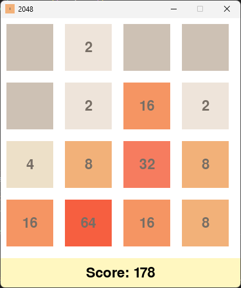

Here is the README.md in English:

# 2048 Game 

This is an implementation of the 2048 game using Python and the Pygame module.

## Gameplay

- Use the arrow keys to move all the tiles
- When two tiles with the same number touch, they merge into one tile with double the number  
- A new tile with the number 2 or 4 will be generated in an empty spot after each move
- The goal is to create higher numbered tiles, with the ultimate goal of reaching 2048
- The game ends when there are no valid moves left

## Features

- Pygame module is used to generate graphics and handle user input
- Progressive score and tile colors 
- Merging tiles make sound effects

## Installation

### Requirements

- Python 3
- Pygame

```
pip install pygame
```

### Running the Game

```
python 2048.py
```

Use the arrow keys to play.

## Game Screenshot

The game screen looks like:



## Credits

This game was developed by csro7788.

For any questions, feel free to contact me at csro7788@gmail.com

## License

This project is released under the MIT License.